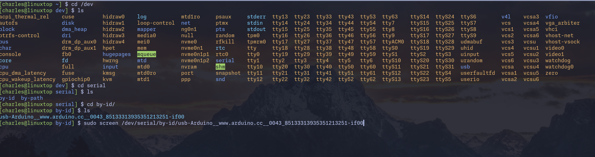

# Journal

This personal project is about creating a small kernel for the BeagleBone black.
I am doing this to learn how kernels work, and what goes into creating one, to
then use that knowledge to help maintain another kernel (Linux).

**Goal**: make a kernel load a helloworld C program and run it, outputs
can be anything (TTY, SSH, HDMI, anything), all on a BeagleBone.

---

The journal will follow **this structure:**

## Month

### Week n : name

  Thoughts for the week, general comment.

  1. Goals for the week,

  2. Extras

(*Day*)

- [ ] Goal being worked on

- What was done to make progress for that goal

> Weeks increment on Tuesdays
> Weekly goals are separated into day-sized tasks

---

As I don't know how to document this project yet, ~~write in markdown~~, or how
to make a kernel, this document, along with many others, ==will
likely change more than once.== This comment will probably go as well.
This was written on the first day: March 31st 2026

---

## March

### Week 1 : The Start (First 3 days)

    This week, I'm just trying to make sure everything is in working order

  1. Make sure I have all required tools (Cables, Boards, IDE, Compilers,
  Computers, Adapters, etc)

  2. Initialize and organize the Github Repository

  3. Test the BeagleBone to make sure it's alive (First, on Linux. Then,
  bare-metal blink maybe?)

(*Tuesday March 31st*)

- [x] Goal 1: *Make sure I have all the required tools*

- I don't have a usb-to-serial adapter

- I made a usb-to-serial using an arduino Uno R3 board without the 328p,
  wires and a voltage divider, because BB only takes 3.3, not 5V like the UNO.

- Tested TTY device connected to itself in my terminal, it's working
  RX and TX LEDS are lighting up when typing:

> screen /dev/serial/by-id/usb-Arduino__www.arduino.cc__0043_85133313935351213251-if00

- [x] Goal 2: *Initialize and organize the Github Repository* (Done)

- I encountered no issues here  

- Added the first .c file called "kernel", gotta start somewhere

- [ ] Goal 3: *Test the BeagleBone to make sure it's alive*

- BeagleBone is not booting, blue light flash when connected and when button
gets pressed, but otherwise nothing else.

## April

---

### Week 1 : The Start (Continuation)

    This week, I need to get a bare-metal sign of life

  1. Find documentation on: specifics of BB (Processor, Architecture, memory
  map, voltage, ttl, etc)

  2. Implement further structure on repository for these steps (Adding extra f
  olders, programs, etc)

  3. Test the BeagleBone and make sure it's alive

  4. +Find useful chapters, paragraphs and details in the documentation

---

(*Wednesday April 1st*)

---

- [x] Goal 3: *Test the BeagleBone and make sure it's alive*

- Next day, it's working for some reason it seems. However, no output on BB's TX
pin. I don't have any measuring device on hand. Wire is fine, connection seems fine.
Maybe the bootloader was compiled to be silent during boot? That would be kind of
annoying.

- BeagleBone is not showing up as a drive, nor accessible via ssh

- A new cable isn't doing anything else. No outside comms. I think the previous
owner might've changed some settings. I'll try flashing the board again

- I'm dumb. I updated my packages yesterday without realizing it also updated the
kernel, meaning modules weren't all working. I restarted and now it works over usb

- [ ] Goal 1: *Find documentation on BeagleBone*

- Fetched documentation for: BeagleBone Black, TI Sitara AM335,
ARM-Cortex A8, ARMv7-A ISA

- I found up-to-date documentation on the board itself on the gitlab of
BeagleBone's website. I then fetched further documentation for: AM335, Cortex-A8,

- I need to find out details about this board. Stuff like the architecture, the
memory, ways to communicate with it when it doesn't have an OS. I'll go read up
on some of it's documentation online

- I also want to know why communication worked over usb, is this a separate chip
or is this part of the kernel that's loaded on there. Apparently there's no TTL
communication by default, so it's likely communicating via some kind of kernel
usb driver, which requires a kernel. I'll need to make sure my arduino solution
works before I try programming something

---

(Thursday April 2nd)

---

- [x] Goal 1: *Find Documentation on BeagleBone*

- I think I have everything I need when it comes to the BeagleBone, I'll
probably be spending the next few days scouting the useful information in these
texts

- [x] Goal 2: Implement further structure

- Added new c files for the kernel, along with different folders

---

### Week 2

    This week, I'm reading a ton of documentation, making sure I understand the
    processor and it's boot process

    1. Read AM335 Documentation: Chapter 3, 8, 9, 10, 26

    2. Find information on Uboot

    3. Learn how linkers work

---

(Tuesday April 7th)

---

- [] Goal 1: Read AM335 Documentation

- So far read Chapter 3, 9, 10. Today I'm reading Chapter 8, talking about
PRCM. I've been reading everyday for the last week or so. I wasted a bit of
time trying to find information in the datasheet, then I learned what TRMs 
were. I saw them before, I guess it didn't click in my head that there's also
one for the BeagleBone's SoC. 

- The BeagleBone is using a System On a Chip, which essentially means if you
were to just give it power and make it's output pins accessible, you'd have
a fully funcionning system. This is essentially what the beaglebone does, but
to make programming easier and allow for bigger projects, the BeagleBone gives
it's owners 4Gb of system memory, and I believe 512mb of DDR3L RAM. Pretty nice.

- There's a ton of crazy cool stuff in the TRM. New terms I learned and concepts like 
Interconnects, Network On Chip, Wakeup Domains, Boot ROM, Power Sequencing, PMIC, 
RTC-Only power modes, Power and Clock Domains, AXI, AMBA, OCP-IP 3.0, and a bunch of 
other stuff. It's all very interesting, but let's focus on the goal before I become a 
random-terms expert.

---

(Sunday April 12th)

- Massive progress has been done this week, even if little to no 
comments have been added here. I think there just wasn't much to
talk about, since I spent most of that time reading. I've been 
reading a bunch of different documentation, from the AM335x TRM
to small snippets of U-Boot documentation, C documentation, etc. 

- I created a Makefile, added folders and a new hierarchy for the
kernel files, along with READMEs. I did a few tests, learned a 
bit about the different compiling stages.

- Here's what's to come: I focused on the boot process. My first
test will be a simple LED blink or UART hello with no kernel. 
For that, I need to understand the boot process (which I think
I've done for the most part), get a bootloader on it and make 
the bootloader load my code. 

- Here's for future reference, and also to explain what I will be
doing: ROM code initializes certain peripherals depending on
SYSBOOT pins (which tell it the peripheral in which the image is
stored) and looks for an image/binary file with a header in that
peripheral. That header contains the program size along with the 
desired loading address target (where you want it). I need to get
a secondary program loader in that space. That secondary program
loader is too big for the OCM, so it's split. The part that's in
OCM will have just enough to initialize peripherals and load the
rest of itself into DRAM. Once in DRAM, it will move the next 
instruction pointer to the start of the rest of itself, so it can
load the program I give it into memory and start that program. 
Now, this is a whole chain of "setup, start, setup, start", but
we're not done yet. C programs rely on kernel-given environment
"things". But, this is the kernel. So, we need to create that 
environment for the C program. Stuff like Stack, heap, and the 
memory sections C programs come to expect. That's what I know I
need to do so far. UART and others will come after. 

---

(Monday April 13th)

- I'm trying to figure out how the code will work together. I 
need to create an assembly file to initialize the C runtime 
before my kernel file even comes in. Then, I need to get the
linker to add that assembly file to the start before the linker
file. Finally, I need to figure out how to make the Make utility
properly do that every time I use the Make command

- I need to read about the ISO C standard, specifically the 
"Freestanding" section, that explains the runtime. Then, I need
to understand more about the ABI, which will help me understand
how to implement the C standard for the ARM processor. Then, I 
need to read on how to give the assembler special instructions
for sections of the C code. Finally, I need to read about linkers
which will help me tell GCC to add the assembly file at the top
of the kernel code after compilation, so the initialization code
can start first. This is the hardest part for me so far. We're
diving into the black box again.

---

## May

---

### Week x

---
